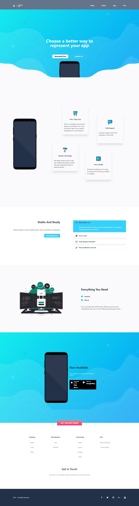

# Groove APP

Landing page for Groove App with animations using React TypeScript, Tailwind CSS, and various React libraries for animations.

## Table of contents

- [Overview](#overview)
  - [The challenge](#the-challenge)
  - [Screenshot](#screenshot)
  - [Links](#links)
- [My process](#my-process)
  - [What I learned](#what-i-learned)
  - [Useful resources](#useful-resources)
- [Author](#author)

## Overview

### The challenge

Users should be able to:

- View the optimal layout for the site depending on their device's screen size
- Transition elements if it is visible in viewport

### Screenshot

### Links

- Live Site URL: [Groove App](https://groove.vercel.app/)

## My process

### Built with

- React TypeScript
- Semantic HTML5 markup
- Tailwind CSS
- Mobile-first workflow
- Framer Motion (For Transitioning)
- Lottie React (For JSON based animation)

### Useful resources

- [React Icons](https://react-icons.github.io/react-icons) - Icon library for React with a lot of icons and variations.
- [Material UI](https://mui.com/) - UI library with prebuilt components.
- [Framer Motion](https://www.framer.com/motion/) - JavaScript library for simple animations.
- [Lottie Files](https://lottiefiles.com/) - JSON based animations.
- [Lottie React](https://lottiereact.com/) - Show Lottie animations with advanced animation functions and props.
- [React Scroll](https://www.npmjs.com/package/react-scroll) - Smooth scroll between elements for React.

## Author

- LinkedIn - [Shibly Sadique](https://www.linkedin.com/in/shibly07/)
